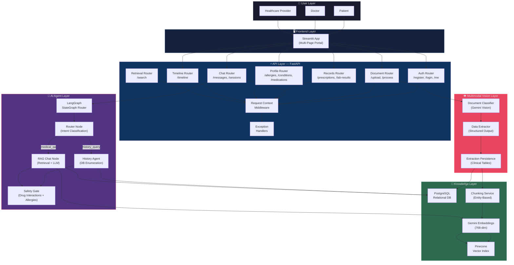
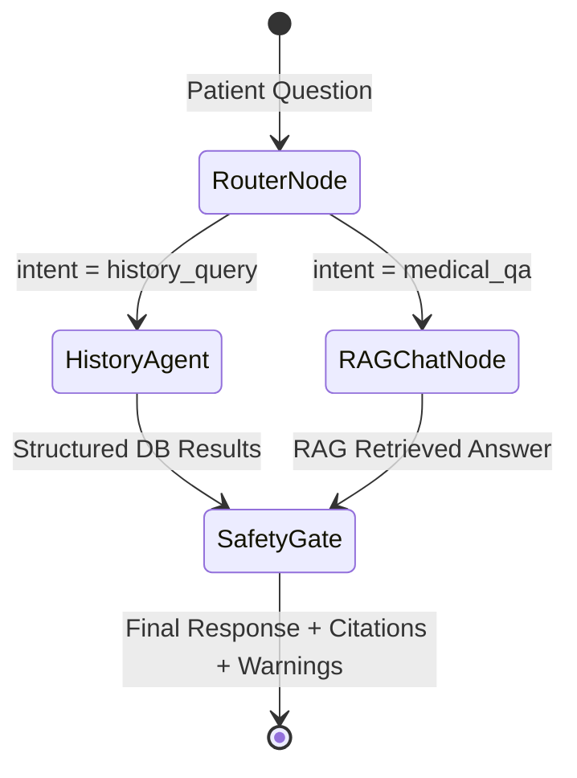
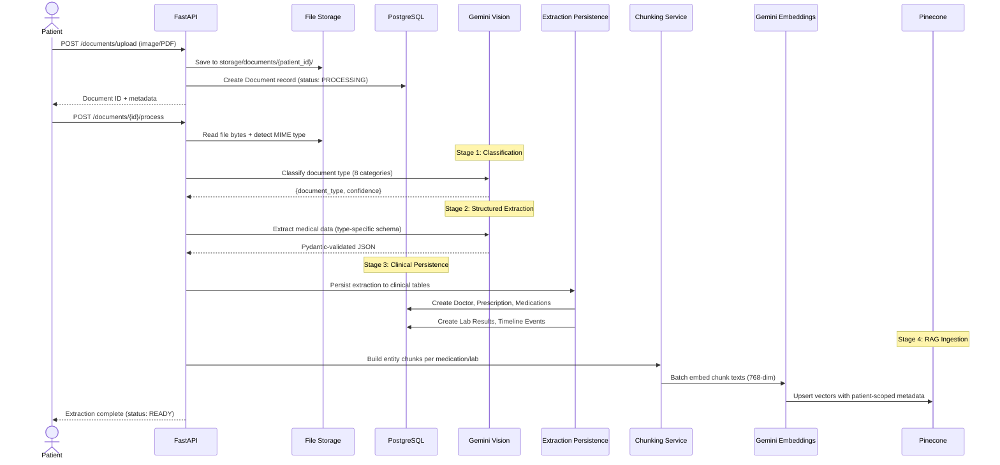
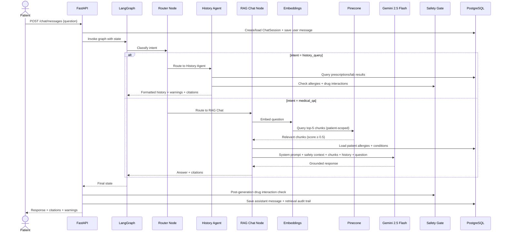
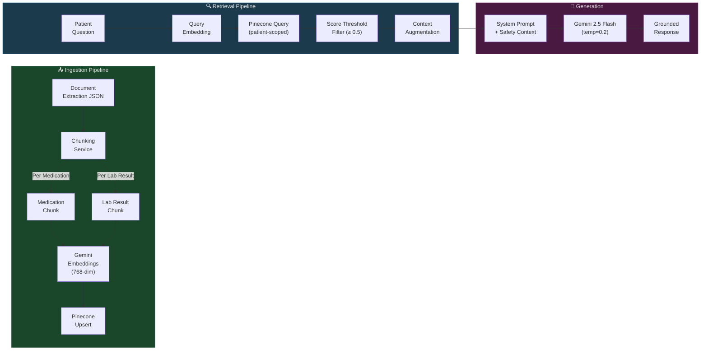
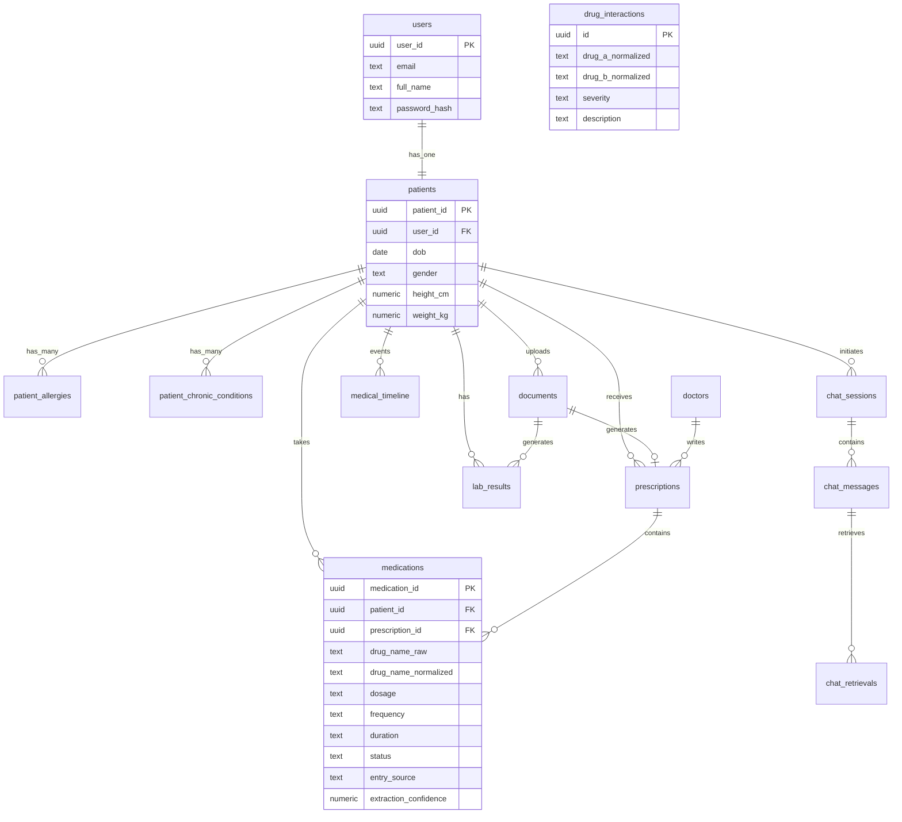

<div align="center">

# 🩺 MediMind AI

### Enterprise Healthcare Intelligence Platform

**Multimodal AI · Autonomous Agents · RAG Pipeline · Drug Safety Intelligence**

[](https://python.org)
[](https://fastapi.tiangolo.com)
[](https://ai.google.dev)
[](https://langchain.com)
[](https://langchain-ai.github.io/langgraph/)
[](https://pinecone.io)
[](https://postgresql.org)
[](https://streamlit.io)
[](LICENSE)
[]()

---

*An enterprise-grade healthcare intelligence platform that transforms medical documents into actionable clinical insights through multimodal AI vision, autonomous agent orchestration, Retrieval-Augmented Generation (RAG), and deterministic patient safety gates.*

[Features](#key-features) · [Architecture](#system-architecture) · [AI Agents](#ai-agent-architecture) · [RAG Pipeline](#rag-architecture) · [Tech Stack](#technology-stack) · [Getting Started](#getting-started) · [API Reference](#api-endpoints) · [Author](#author)

</div>

---

## 📋 Executive Summary

**MediMind AI** is a full-stack healthcare intelligence platform that enables patients and healthcare providers to upload medical documents—including handwritten prescriptions, printed prescriptions, lab reports, discharge summaries, and insurance documents—and receive structured, AI-extracted clinical data with intelligent conversational insights.

The platform combines **Google Gemini 2.5 Flash** multimodal vision for document understanding, a **LangGraph-orchestrated multi-agent system** for intelligent query routing, and a **Pinecone-powered RAG pipeline** for grounded medical conversations—all wrapped behind a secure **FastAPI** backend with **JWT authentication** and a **Streamlit** interactive frontend.

### Who Is This For?

| Audience | Value Proposition |
|---|---|
| **Patients** | Upload prescriptions and lab reports, ask natural-language questions about medications, get drug interaction warnings |
| **Doctors & Clinicians** | Digitize handwritten prescriptions, track patient medication history, receive automated safety alerts |
| **Healthcare Organizations** | Reduce manual data entry, build structured patient records from unstructured documents |
| **AI/ML Engineers** | Study production-grade multi-agent orchestration, RAG pipelines, and multimodal AI integration patterns |

---

## 🔍 Problem Statement

Healthcare systems worldwide face critical challenges in managing medical information:

| Challenge | Impact |
|---|---|
| **Illegible Handwritten Prescriptions** | Medication errors due to misread drug names, dosages, and instructions—a leading cause of preventable harm |
| **Fragmented Patient Records** | Medical history scattered across paper documents, PDFs, and disconnected systems |
| **Undetected Drug Interactions** | Patients prescribed conflicting medications by different providers without cross-referencing |
| **Manual Data Entry Burden** | Clinical staff spend significant time transcribing document content into digital systems |
| **Limited Patient Understanding** | Patients struggle to interpret medical terminology, lab values, and treatment plans |
| **Absence of Safety Guardrails** | Existing systems lack real-time allergy cross-checks and drug interaction detection at the point of query |

These problems translate into medication errors, delayed diagnoses, increased costs, and diminished patient safety.

---

## 💡 Solution Overview

MediMind AI addresses each challenge through a layered AI-first architecture:

```
📄 Document Upload ──→ 🔬 Multimodal Vision OCR ──→ 📊 Structured Extraction
                                                           │
                     ┌─────────────────────────────────────┘
                     ▼
              🧬 Entity Chunking ──→ 🔢 Embedding ──→ 🌲 Pinecone Vector Store
                                                           │
              💬 Patient Question ──→ 🤖 Agent Router ─────┤
                                           │               │
                              ┌────────────┼───────────┐   │
                              ▼            ▼           ▼   ▼
                        📋 History    🔎 RAG Chat   ⚠️ Safety
                         Agent         Node         Gate
                              │            │           │
                              └────────────┴───────────┘
                                           │
                                    📨 Grounded Response
                                    with Citations & Warnings
```

| Capability | How It Works |
|---|---|
| **AI-Powered Document Intelligence** | Gemini 2.5 Flash vision classifies and extracts structured data from 8 document types including handwritten prescriptions |
| **Structured Medical Data Persistence** | Extracted data is normalized into relational tables: prescriptions, medications, lab results, doctors, and timeline events |
| **Entity-Based RAG** | Each medication and lab result becomes an individually embeddable entity chunk, enabling precise retrieval |
| **Autonomous Agent Routing** | LangGraph state machine routes queries to the optimal processing path—direct database enumeration or RAG-augmented generation |
| **Deterministic Drug Safety** | Pairwise drug interaction checking and allergy cross-referencing execute as deterministic database lookups, not probabilistic LLM outputs |
| **Grounded Conversations** | Every AI response is strictly grounded in retrieved patient records with source citations—no hallucination allowed |

---

## ✨ Key Features

| # | Feature | Description | Implementation |
|---|---|---|---|
| 1 | **Multimodal Document OCR** | Classify and extract structured data from images and PDFs of 8 medical document types | Gemini 2.5 Flash Vision + LangChain Structured Output |
| 2 | **Handwritten Prescription Support** | Process and digitize handwritten prescriptions with confidence scoring | Multimodal vision with adaptive confidence thresholds |
| 3 | **Drug Interaction Detection** | Real-time pairwise drug-drug interaction checking against a known interaction database | Deterministic SQL-based safety gate |
| 4 | **Allergy Safety Warnings** | Cross-reference prescribed medications against patient-declared allergies | Pattern-matching safety layer in History Agent |
| 5 | **RAG Medical Chat** | Context-grounded conversational AI using patient-specific medical records | Pinecone vector retrieval + Gemini chat generation |
| 6 | **Multi-Agent Orchestration** | LangGraph routing graph directing queries through specialized processing nodes | StateGraph with conditional edges |
| 7 | **Medical Timeline** | Chronological event log of prescriptions, lab reports, and clinical encounters | Auto-generated from extraction pipeline |
| 8 | **Patient Profile Management** | Self-declared allergies, chronic conditions, and manual medication entry | CRUD APIs with automatic Pinecone vector sync |
| 9 | **JWT Authentication** | Secure user registration, login, and token-based access control | HS256 JWT with bcrypt password hashing |
| 10 | **Streamlit Frontend** | Interactive patient portal with login, registration, upload center, and records viewer | Multi-page Streamlit application |

---

## 🏗️ System Architecture

### High-Level Architecture Diagram



### Layer Breakdown

| Layer | Components | Responsibility |
|---|---|---|
| **User Layer** | Patients, Doctors, Healthcare Providers | Interact with the platform via the Streamlit portal or API |
| **Frontend Layer** | Streamlit multi-page app (Login, Register, Upload Center, Medical Records, Timeline) | Authentication, document upload, records browsing, and chat interface |
| **API Layer** | FastAPI with 9 routers, JWT middleware, exception handlers | RESTful API gateway with request tracing and structured error responses |
| **AI Agent Layer** | LangGraph StateGraph, Router Node, History Agent, RAG Chat Node, Safety Gate | Intelligent query routing and grounded response generation |
| **Vision Layer** | Gemini 2.5 Flash multimodal, LangChain structured output, extraction persistence | Document classification, OCR, structured data extraction |
| **Knowledge Layer** | Pinecone (cosine similarity, 768-dim), PostgreSQL (14 tables), Gemini embeddings | Persistent clinical data and semantic vector search |

---

## 🤖 AI Agent Architecture

MediMind AI implements a **3-node LangGraph state machine** with conditional routing, forming a directed acyclic graph (DAG) that processes every patient query through the optimal path.

### Agent Topology



### Agent Details

| Agent | Purpose | Input | Output | Key Implementation Detail |
|---|---|---|---|---|
| **Router Node** | Classify user intent without LLM invocation | Patient question string | `intent: history_query \| medical_qa` | Keyword-based classification using configurable trigger and override keyword lists—zero-latency, deterministic routing |
| **History Agent** | Direct database enumeration for listing queries | Patient ID + classified intent | Formatted prescription/lab history with safety warnings | Executes structured SQL queries, applies allergy cross-checks and drug interaction detection, returns deterministic results |
| **RAG Chat Node** | Semantic retrieval + LLM generation for explanatory queries | Patient question + conversation history | Grounded AI response with source citations | Embeds question → queries Pinecone → filters by relevance threshold (0.5) → augments Gemini prompt with retrieved chunks |
| **Safety Gate** | Deterministic drug interaction and allergy checking | Patient's active medications | Interaction warnings with severity levels | Pairwise comparison of active drugs against `drug_interactions` table; pattern-matches medications against patient allergies |

### Agent Collaboration Flow

1. **Every query enters the Router Node** — keyword substring matching determines if the user wants a listing (`"show my prescriptions"`) or an explanation (`"why was I prescribed aspirin?"`).
2. **Explanation override keywords** (`why`, `explain`, `side effect`, `interaction`) force routing to RAG Chat even if listing keywords are present — ensuring medical explanations are always AI-generated.
3. **The History Agent bypasses the LLM entirely** for enumeration queries, querying PostgreSQL directly and formatting results deterministically — this guarantees accuracy for factual record listing.
4. **The Safety Gate executes after both paths**, checking for drug-drug interactions and allergy conflicts. Warnings are injected into the final response with severity indicators.

---

## 🔄 End-to-End Workflow

### Document Processing Pipeline



### Chat Query Pipeline



### Detailed Step-by-Step Flow

1. **Document Upload** — Patient uploads an image or PDF via `POST /documents/upload`. The file is validated (type, size ≤ 15 MB) and stored to disk under `storage/documents/{patient_id}/`.
2. **AI Classification** — Gemini Vision classifies the document into one of 8 categories: `prescription_printed`, `prescription_handwritten`, `lab_report`, `drug_package`, `medical_bill`, `discharge_summary`, `insurance_document`, or `medical_record`.
3. **Structured Extraction** — A type-specific prompt guides Gemini to extract structured JSON using LangChain's `with_structured_output()`, enforcing Pydantic schema validation.
4. **Clinical Persistence** — The `ExtractionPersistenceService` transactionally writes extracted data to PostgreSQL tables: `doctors`, `prescriptions`, `medications`, `lab_results`, and `medical_timeline`.
5. **Drug Normalization** — Raw drug names from OCR are normalized for consistent matching across the interaction database.
6. **Entity Chunking** — Each medication and lab result is converted into a natural-language sentence chunk with structured metadata.
7. **Vector Embedding** — Chunks are batch-embedded using `gemini-embedding-001` (768 dimensions) and upserted to Pinecone with patient-scoped metadata filters.
8. **Query Processing** — Patient questions enter the LangGraph StateGraph, which routes to the History Agent or RAG Chat Node based on keyword-based intent classification.
9. **Safety Gate** — Active medications are checked pairwise against the `drug_interactions` table. Allergy conflicts are detected by pattern-matching medication names against recorded allergens.
10. **Response Generation** — The final response includes the AI-generated answer, source document citations, and any safety warnings—all persisted as an audit trail in `chat_messages` and `chat_retrievals` tables.

---

## 🧠 RAG Architecture

MediMind AI implements an **Entity-Based RAG** pattern—rather than chunking raw document text, the system creates semantically meaningful chunks from structured database entities.

### RAG Pipeline Architecture



### Chunking Strategy

The system uses **entity-based chunking** rather than naive text splitting:

| Entity Type | Chunk Template | Example Output |
|---|---|---|
| **Medication** | `{drug}, {dosage}, {frequency}, for {duration}. Instructions: {instructions}. Prescribed by {doctor} on {date} for {diagnosis}.` | `Metformin 500mg, twice daily, for 3 months. Prescribed by Dr. Kumar on 2025-07-15 for Type 2 Diabetes.` |
| **Lab Result** | `{test_name}: {value} {unit} (reference range: {ref}, flag: {flag}) on {date}.` | `HbA1c: 7.2 % (reference range: 4.0-5.6, flag: High) on 2025-07-20.` |

### Key RAG Design Decisions

| Decision | Rationale |
|---|---|
| **Entity-level granularity** | Each medication and lab result is independently retrievable, enabling precise answers to questions like "What is my dosage of Metformin?" |
| **Patient-scoped filtering** | All Pinecone queries include a mandatory `patient_id` metadata filter, ensuring strict data isolation |
| **Relevance threshold (0.5)** | Chunks below the cosine similarity threshold are excluded; if no chunks pass, a graceful fallback message is returned |
| **Idempotent re-ingestion** | Before upserting, existing vectors for the document are deleted, preventing duplicate entries on re-processing |
| **Metadata-enriched vectors** | Each vector carries `document_id`, `chunk_type`, `event_date`, `source`, and `entry_source` metadata for filtering and audit |

---

## 🔬 Multimodal Intelligence Pipeline

### Supported Document Types

| Document Type | Classification Key | Extraction Schema | Clinical Persistence |
|---|---|---|---|
| Printed Prescription | `prescription_printed` | Doctor, Patient, Medicines, Diagnosis, Follow-up | ✅ Doctors, Prescriptions, Medications, Timeline |
| Handwritten Prescription | `prescription_handwritten` | Doctor, Patient, Medicines, Diagnosis, Follow-up | ✅ Doctors, Prescriptions, Medications, Timeline |
| Lab Report | `lab_report` | Tests (name, value, unit, reference, flag, date) | ✅ Lab Results, Timeline |
| Drug Package | `drug_package` | Summary, Key Dates, Entities, Notes | ⬜ Generic extraction (no structured persistence yet) |
| Medical Bill | `medical_bill` | Summary, Key Dates, Entities, Notes | ⬜ Generic extraction |
| Discharge Summary | `discharge_summary` | Summary, Key Dates, Entities, Notes | ⬜ Generic extraction |
| Insurance Document | `insurance_document` | Summary, Key Dates, Entities, Notes | ⬜ Generic extraction |
| Medical Record | `medical_record` | Summary, Key Dates, Entities, Notes | ⬜ Generic extraction |

### Vision Pipeline Details

1. **Classification Stage** — Gemini Vision analyzes the document image and classifies it into one of 8 categories with a confidence score. Temperature is set to `0.0` for deterministic classification.
2. **Extraction Stage** — A type-specific prompt with the target JSON schema is sent to Gemini Vision. LangChain's `with_structured_output()` enforces Pydantic schema validation on the response.
3. **Confidence Gating** — Documents classified with confidence ≥ 0.75 receive `READY` status; those below receive `NEEDS_REVIEW`, flagging them for human verification.
4. **Patient Mismatch Detection** — The system compares the extracted patient name against the authenticated patient's profile and logs a warning if they don't loosely match.

---

## 🛡️ Safety Architecture

MediMind AI implements **three independent safety layers** that operate deterministically—never relying on LLM probabilistic output for safety-critical decisions:

### 1. System Prompt Safety Boundaries

The system prompt enforces 7 hard mandatory rules:

- **Grounded in context only** — No assumptions, no extrapolation
- **No diagnosis** — Never diagnoses diseases or conditions
- **No prescribing** — Never prescribes or changes medications
- **Missing information fallback** — Explicitly states when records are insufficient
- **Prominent safety warnings** — Flags conflicts with allergies and conditions
- **General vs. record-specific** — Clearly delineates general health education from patient-specific facts
- **Unverified medication warnings** — Flags medications not on file

### 2. Deterministic Drug Interaction Checking

```python
# All active medications are checked pairwise against known interactions
for i in range(len(active_drug_names)):
    for j in range(i + 1, len(active_drug_names)):
        # Cross-reference against drug_interactions table
        # Severity-tagged warnings injected into response
```

### 3. Allergy Cross-Reference Gate

The History Agent pattern-matches every mentioned medication against the patient's recorded allergies, emitting `⚠️ SAFETY WARNING` alerts with the specific allergen and reaction.

---

## 🛠️ Technology Stack

### AI & Machine Learning

| Technology | Purpose | Configuration |
|---|---|---|
| **Google Gemini 2.5 Flash** | Multimodal vision classification, structured extraction, chat generation | `temperature=0.0` (vision), `temperature=0.2` (chat) |
| **Gemini Embedding 001** | Vector embeddings for RAG pipeline | 768-dimensional, batched (50/batch) |
| **LangChain** | LLM orchestration, structured output, multimodal messages | Pydantic schema enforcement |
| **LangGraph** | Multi-agent state machine with conditional routing | Compiled singleton DAG |

### Backend & API

| Technology | Purpose |
|---|---|
| **FastAPI** | Async REST API framework with OpenAPI documentation |
| **Pydantic v2** | Request/response validation, settings management |
| **SQLAlchemy 2.0** | ORM with mapped columns, relationships, and type annotations |
| **Alembic** | Database migration management |
| **python-jose** | JWT token encoding and decoding |
| **passlib + bcrypt** | Password hashing and verification |
| **Uvicorn** | ASGI server for production deployment |

### Databases & Storage

| Technology | Purpose | Configuration |
|---|---|---|
| **PostgreSQL** | Relational clinical data store (14 tables) | Connection pooling, retry with backoff, health monitoring |
| **Pinecone** | Serverless vector database for RAG | Cosine similarity, AWS us-east-1, metadata filtering |
| **File System** | Raw document storage | `storage/documents/{patient_id}/` |

### Frontend

| Technology | Purpose |
|---|---|
| **Streamlit** | Multi-page interactive patient portal |

### Infrastructure & Observability

| Technology | Purpose |
|---|---|
| **Structured JSON Logging** | Request-scoped logging with correlation IDs |
| **Request Context Middleware** | UUID-based request tracing and execution timing |
| **Database Health Monitoring** | Async background task with periodic ping and auto-reconnect |
| **Retry with Exponential Backoff** | Database connection resilience (5 attempts, linear delay) |

---

## 📁 Project Structure

```
MediMind-AI/
├── agents/                          # 🤖 AI Agent Layer
│   ├── chat_graph.py                #   LangGraph routing workflow (Router → History/RAG → End)
│   ├── graph_state.py               #   TypedDict state schema for graph nodes
│   ├── chat_router_node.py          #   Keyword-based intent classifier (zero-latency)
│   ├── history_agent_node.py        #   Direct DB enumeration + safety gate (278 lines)
│   ├── chat_llm_client.py           #   Gemini chat response generator with history
│   ├── chat_prompts.py              #   System prompt builder with 7 safety rules
│   ├── extraction_prompts.py        #   Type-specific OCR extraction prompt templates
│   ├── langchain_client.py          #   Multimodal vision classification + extraction
│   ├── pinecone_client.py           #   Pinecone CRUD: upsert, query, delete (with fallback)
│   └── embedding_client.py          #   Gemini embedding wrapper (single + batch)
│
├── app/                             # ⚡ Application Entry Point
│   └── main.py                      #   FastAPI app factory, lifespan events, router registration
│
├── services/                        # 🔧 Business Logic Layer
│   ├── chat_service.py              #   Chat orchestration: sessions, RAG, safety, audit (230 lines)
│   ├── document_service.py          #   Document CRUD + cascade deletion with Pinecone cleanup
│   ├── extraction_service.py        #   4-stage AI extraction pipeline
│   ├── extraction_persistence_service.py  # Clinical table persistence (prescriptions, labs)
│   ├── chunking_service.py          #   Entity-based chunk builder (medication + lab result)
│   ├── rag_ingestion_service.py     #   Orchestrates chunking → embedding → Pinecone upsert
│   ├── retrieval_service.py         #   Semantic search over patient-scoped vectors
│   └── safety_context_service.py    #   Allergy + chronic condition + drug interaction checks
│
├── routers/                         # 🌐 API Endpoints (9 routers)
│   ├── auth_router.py               #   /register, /login, /me, /logout
│   ├── chat_router.py               #   /chat/messages, /chat/sessions
│   ├── document_router.py           #   /documents/upload, /documents/{id}/process
│   ├── patient_profile_router.py    #   /profile/allergies, /conditions, /medications
│   ├── records_router.py            #   /records/prescriptions, /records/lab-results
│   ├── retrieval_router.py          #   /retrieval/search (debug/testing)
│   ├── timeline_router.py           #   /timeline
│   ├── health_router.py             #   /health
│   └── database_router.py           #   /database/health
│
├── models/                          # 📊 ORM Models (14 tables)
│   ├── user_model.py                #   User accounts
│   ├── patient_model.py             #   Patient profiles (1:1 with users)
│   ├── doctor_model.py              #   Doctor records (find-or-create pattern)
│   ├── document_model.py            #   Uploaded document metadata + extraction JSON
│   ├── prescription_model.py        #   Prescription records with diagnosis array
│   ├── medication_model.py          #   Medication records (raw + normalized drug names)
│   ├── lab_result_model.py          #   Lab test results with reference ranges
│   ├── drug_interaction_model.py    #   Known pairwise drug-drug interactions
│   ├── patient_allergy_model.py     #   Self-declared allergies with reaction/severity
│   ├── patient_chronic_condition_model.py  # Chronic conditions with status
│   ├── medical_timeline_model.py    #   Chronological medical event log
│   ├── chat_session_model.py        #   Chat conversation sessions
│   ├── chat_message_model.py        #   Individual chat messages with metadata
│   └── chat_retrieval_model.py      #   RAG retrieval audit trail
│
├── database/                        # 🗄️ Database Layer
│   ├── connection.py                #   Engine factory, retry logic, health monitor
│   ├── session.py                   #   SQLAlchemy session factory
│   ├── base.py                      #   Declarative base
│   └── repositories/               #   Repository pattern (13 repositories)
│
├── schemas/                         # 📋 Pydantic Schemas
│   ├── request/                     #   API request validation schemas
│   ├── response/                    #   API response serialization schemas
│   ├── extraction/                  #   AI extraction Pydantic schemas
│   └── retrieval/                   #   RAG retrieval data structures
│
├── core/                            # 🔐 Security & Infrastructure
│   ├── auth/                        #   JWT authentication service + dependencies
│   ├── database/                    #   Database health checks
│   ├── errors/                      #   Error handling utilities
│   └── health/                      #   Application health checks
│
├── frontend/                        # 🖥️ Streamlit Frontend
│   ├── app.py                       #   Main portal with auth gate and dashboard
│   ├── pages/                       #   Multi-page navigation
│   │   ├── 1_Login.py               #   JWT login form
│   │   ├── 2_Register.py            #   User registration
│   │   ├── 3_Upload_Center.py       #   Document upload + processing trigger
│   │   ├── 4_Medical_Records.py     #   Prescription & lab result viewer
│   │   └── 5_Timeline.py           #   Chronological medical timeline
│   └── utils/                       #   API client utilities
│
├── handlers/                        # 🎯 Request Handlers (Controller Layer)
├── helpers/                         # 🔨 Utility Functions
│   ├── drug_normalizer.py           #   Drug name normalization
│   ├── file_storage.py              #   File I/O and MIME detection
│   ├── response_helper.py           #   Standardized response builder
│   └── datetime_helper.py           #   UTC datetime utilities
│
├── middleware/                      # 🛡️ Middleware
│   ├── request_context.py           #   Request ID generation + execution timing
│   └── token_context.py             #   JWT token context extraction
│
├── exceptions/                      # ⚠️ Custom Exceptions
│   ├── custom_exceptions.py         #   Domain-specific exception hierarchy
│   └── exception_handler.py         #   Global FastAPI exception handlers
│
├── app_logging/                     # 📝 Structured Logging
│   └── logger.py                    #   JSON logger with request context
│
├── config/                          # ⚙️ Configuration
│   ├── settings.py                  #   Pydantic BaseSettings from .env
│   └── constants.py                 #   Centralized constants (184 lines)
│
├── alembic/                         # 🔄 Database Migrations
├── storage/                         # 💾 Document File Storage
├── logs/                            # 📄 Application Logs
├── requirements.txt                 # 📦 Python Dependencies
└── alembic.ini                      # 🔄 Alembic Configuration
```

---

## 🌐 API Endpoints

### Authentication

| Method | Endpoint | Description |
|---|---|---|
| `POST` | `/api/v1/register` | Create user account and linked patient profile |
| `POST` | `/api/v1/login` | Authenticate and receive JWT access token |
| `GET` | `/api/v1/me` | Get authenticated user profile |
| `POST` | `/api/v1/logout` | Stateless logout confirmation |

### Documents

| Method | Endpoint | Description |
|---|---|---|
| `POST` | `/api/v1/documents/upload` | Upload medical document (image/PDF, ≤ 15 MB) |
| `POST` | `/api/v1/documents/{id}/process` | Trigger AI extraction pipeline |
| `GET` | `/api/v1/documents/{id}` | Get document metadata and extraction status |
| `GET` | `/api/v1/documents` | List patient documents (paginated) |
| `DELETE` | `/api/v1/documents/{id}` | Cascade delete document + derived records + vectors |

### Chat

| Method | Endpoint | Description |
|---|---|---|
| `POST` | `/api/v1/chat/messages` | Send question to grounded medical chat assistant |
| `GET` | `/api/v1/chat/sessions` | List patient chat sessions (paginated) |
| `GET` | `/api/v1/chat/sessions/{id}/messages` | Get full chat history for a session |

### Patient Profile

| Method | Endpoint | Description |
|---|---|---|
| `POST` | `/api/v1/profile/allergies` | Declare an allergy |
| `GET` | `/api/v1/profile/allergies` | List declared allergies |
| `DELETE` | `/api/v1/profile/allergies/{id}` | Remove allergy record |
| `POST` | `/api/v1/profile/conditions` | Declare a chronic condition |
| `GET` | `/api/v1/profile/conditions` | List chronic conditions |
| `DELETE` | `/api/v1/profile/conditions/{id}` | Remove condition record |
| `POST` | `/api/v1/profile/medications` | Manually add a medication (with Pinecone sync) |
| `GET` | `/api/v1/profile/medications` | List all medications |
| `DELETE` | `/api/v1/profile/medications/{id}` | Discontinue medication (with Pinecone cleanup) |

### Records & Timeline

| Method | Endpoint | Description |
|---|---|---|
| `GET` | `/api/v1/records/prescriptions` | List prescriptions with medications and doctor info |
| `GET` | `/api/v1/records/lab-results` | List lab results with reference ranges |
| `GET` | `/api/v1/timeline` | Chronological medical event timeline |

### Infrastructure

| Method | Endpoint | Description |
|---|---|---|
| `GET` | `/api/v1/health` | Application health check |
| `GET` | `/api/v1/database/health` | Database connectivity check |
| `POST` | `/api/v1/retrieval/search` | Debug endpoint for semantic vector search |

---

## 📊 Database Schema

The PostgreSQL schema consists of **14 interconnected tables**:



---

## 🚀 Getting Started

### Prerequisites

- **Python 3.11+**
- **PostgreSQL 14+**
- **Google Cloud API Key** (Gemini 2.5 Flash access)
- **Pinecone API Key** (free tier works)

### Installation

```bash
# Clone the repository
git clone https://github.com/your-username/medimind-ai.git
cd medimind-ai

# Create virtual environment
python -m venv venv
source venv/bin/activate  # Linux/macOS
# venv\Scripts\activate   # Windows

# Install dependencies
pip install -r requirements.txt
```

### Environment Configuration

Create a `.env` file in the project root:

```env
# Application
APP_NAME=MediMind AI API
ENVIRONMENT=development
DEBUG=true

# Google Gemini AI
GOOGLE_API_KEY=your-google-api-key

# PostgreSQL Database
DB_DRIVER=postgresql+psycopg2
DB_HOST=localhost
DB_PORT=5432
DB_NAME=medimind_db
DB_USER=your-db-user
DB_PASSWORD=your-db-password

# Pinecone Vector Database
PINECONE_API_KEY=your-pinecone-api-key
PINECONE_INDEX_NAME=medimind-medical-records

# JWT Authentication
JWT_SECRET_KEY=your-secret-key
JWT_ALGORITHM=HS256
ACCESS_TOKEN_EXPIRE_MINUTES=1440
```

### Database Setup

```bash
# Create PostgreSQL database
createdb medimind_db

# Tables are auto-created on startup via SQLAlchemy ORM
# OR use Alembic for managed migrations:
alembic upgrade head
```

### Running the Application

```bash
# Start FastAPI backend
uvicorn app.main:app --reload --host 0.0.0.0 --port 8000

# Start Streamlit frontend (separate terminal)
streamlit run frontend/app.py
```

### Verify Installation

```bash
# Health check
curl http://localhost:8000/api/v1/health

# API documentation
open http://localhost:8000/docs
```

---

## 💼 Sample Use Cases

### 1. Prescription Analysis

> **Patient uploads a photo of a handwritten prescription.**
> MediMind AI classifies it as `prescription_handwritten`, extracts the doctor's name, patient info, 3 medications with dosages, and a diabetes diagnosis. Each medication is persisted to the database and embedded into Pinecone.

### 2. Drug Safety Verification

> **Patient asks: "Can I take the Aspirin prescribed by Dr. Sharma along with my Warfarin?"**
> The Safety Gate detects a **HIGH severity** interaction between Aspirin and Warfarin from the `drug_interactions` table and injects a prominent warning into the response.

### 3. Clinical Decision Support

> **Patient asks: "Why was I prescribed Metformin and what are the side effects?"**
> The Router Node classifies this as `medical_qa` (explanation override keyword "why"). The RAG Chat Node retrieves the patient's Metformin prescription chunk from Pinecone, and Gemini generates a grounded explanation referencing the specific prescription context.

### 4. Medical History Retrieval

> **Patient asks: "Show me all my prescriptions for diabetes."**
> The Router Node classifies this as `history_query` (trigger word "show" + entity keyword "prescription"). The History Agent queries PostgreSQL directly, filters by diagnosis containing "diabetes", formats the results deterministically, and checks for allergy conflicts.

### 5. Lab Report Intelligence

> **Patient uploads a blood test report with 12 test parameters.**
> MediMind AI extracts each test (HbA1c, CBC, lipid panel) with values, units, reference ranges, and flags. Abnormal values are flagged. The patient later asks "Is my HbA1c normal?" and receives a grounded response with the specific value, reference range, and flag.

---

## 🏆 Engineering Highlights

| Engineering Area | Implementation Detail |
|---|---|
| **Multi-Agent State Machine** | LangGraph `StateGraph` with compile-time optimization, conditional routing edges, and shared `TypedDict` state propagation across nodes |
| **Entity-Based RAG** | Clinical entities (medications, lab results) chunked individually rather than naive document splitting—enabling precise, granular retrieval |
| **Deterministic Safety Gates** | Drug interactions and allergy checks execute as SQL queries and string matching—not delegated to probabilistic LLM output |
| **Hybrid Query Architecture** | Listing queries bypass the LLM entirely (History Agent → direct SQL), while explanation queries use RAG (embedding → Pinecone → Gemini)—optimizing both accuracy and latency |
| **Pydantic-Enforced Vision Output** | LangChain's `with_structured_output()` ensures all AI extraction conforms to typed Pydantic schemas at inference time |
| **Idempotent Ingestion Pipeline** | Document re-processing safely deletes existing vectors and database rows before re-inserting—preventing duplicate data |
| **Patient-Scoped Vector Isolation** | All Pinecone queries include mandatory `patient_id` metadata filter—no cross-patient data leakage |
| **Audit Trail Architecture** | Every chat interaction stores the retrieval context (`chat_retrievals`), model metadata, and chunk citations for compliance and debugging |
| **Graceful Degradation** | Fallback paths for insufficient retrieval relevance, missing Pinecone connection, and failed extractions—the system never crashes silently |
| **Repository Pattern** | 13 domain-specific repositories abstracting SQLAlchemy queries with consistent error handling and request tracing |

---

## 🔮 Future Enhancements

Based on the current architecture, the following enhancements are natural extensions:

| Enhancement | Description | Architecture Readiness |
|---|---|---|
| **Real-Time Chat Streaming** | Server-Sent Events (SSE) for token-by-token LLM response delivery | FastAPI async endpoints are ready for SSE integration |
| **FHIR Interoperability** | HL7 FHIR R4 resource mapping for EHR integration | Structured ORM models map closely to FHIR resources |
| **Async Document Processing** | Background task queues (Celery/Redis) for non-blocking extraction | Current synchronous pipeline is modular and separable |
| **Multi-Language Support** | Prescription OCR and chat in Hindi, Spanish, and other languages | Gemini 2.5 Flash supports multilingual processing |
| **Voice Input** | Speech-to-text for elderly and accessibility use cases | Chat pipeline accepts text input; voice is a frontend addition |
| **Advanced Interaction Database** | FDA drug interaction API integration for comprehensive coverage | `drug_interactions` table schema supports scalable reference data |
| **Doctor-Facing Dashboard** | Multi-patient analytics, prescription trends, and population health | Patient-scoped architecture supports role-based multi-tenancy |
| **PDF Report Generation** | Downloadable patient health summaries | Timeline and records APIs provide the necessary data |
| **Mobile Application** | React Native or Flutter frontend consuming the existing API | RESTful API is fully decoupled from the Streamlit frontend |

---

## 📈 Impact & Outcomes

### Business Value

| Metric | Impact |
|---|---|
| **Document Processing Time** | Reduces manual prescription transcription from ~5 minutes to seconds |
| **Drug Safety Coverage** | Automated pairwise interaction checking catches conflicts that manual review misses |
| **Patient Engagement** | Natural-language Q&A enables patients to understand their health records without clinical training |
| **Data Structuring** | Converts unstructured documents into queryable, relational clinical data |

### Healthcare Benefits

- **Reduced medication errors** through automated allergy and interaction checking
- **Improved patient literacy** via grounded, cited explanations of medical records
- **Unified health timeline** providing longitudinal visibility into a patient's clinical journey
- **Digitized handwritten prescriptions** preserving clinical information that would otherwise be lost

### AI Innovation

- Demonstrates a **production pattern for healthcare AI** with strict safety boundaries
- Showcases **multi-agent orchestration** balancing deterministic accuracy (History Agent) with generative intelligence (RAG Chat)
- Implements **responsible AI practices**: grounding, citation, confidence gating, and explicit fallback behavior
